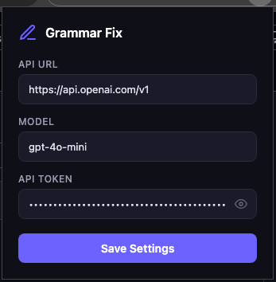
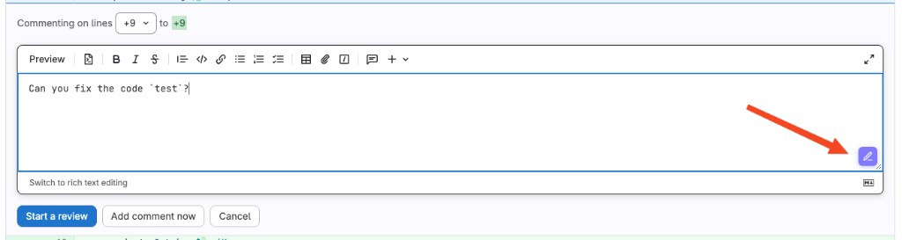

# User Guide

This guide shows how to configure and use the extension on any website.

## 1) Open Extension Settings

1. Open Chrome and pin the extension icon to the toolbar (optional but convenient).
2. Click the extension icon.
3. The settings popup opens.

## 2) Configure API

In the popup:

- **API URL**: default is `https://api.openai.com/v1`
- **Model**: for example `gpt-4o-mini`
- **API Token**: your provider token

Then click **Save Settings**.

What happens on save:

- Extension calls `GET {apiUrl}/models`
- Verifies token is valid
- Verifies model exists for that token
- Saves only if validation succeeds

If validation fails, you will get a detailed error (for example invalid URL, unauthorized token, model not found, rate limit).

## 3) Use Grammar Fix on a Website

1. Open any site with a text field (textarea, text input, or contenteditable).
2. Type text with mistakes.
3. Click the purple fix icon at the bottom-right of the field.
4. Wait for spinner.
5. Text is replaced with corrected output.

## 4) Expected Behavior

- Works on static and dynamically added fields (SPA pages)
- Handles multiple fields per page
- Shows error tooltip if request fails
- Does not send token to page scripts (token is used in extension service worker only)

## 5) Troubleshooting

- **Unauthorized (401)**: token is wrong/expired
- **Endpoint not found (404)**: API URL is wrong (OpenAI should be `https://api.openai.com/v1`)
- **Model not found**: choose a model available for your token
- **Rate limit (429)**: quota exceeded, try later or use another key
